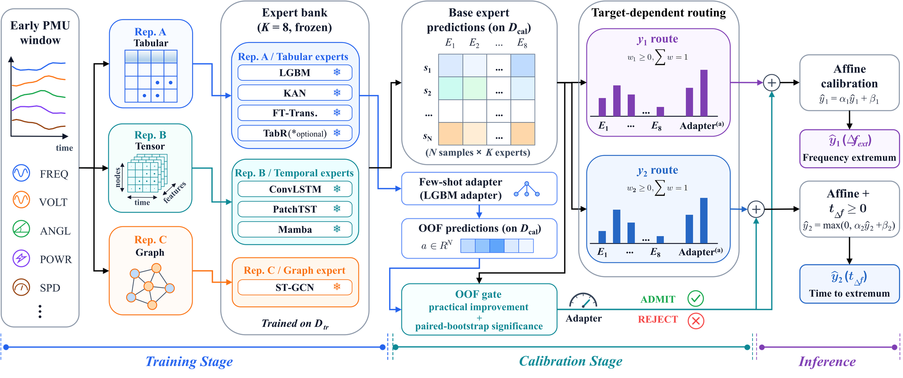

# TD-HER

<p align="center">
  
</p>

> **Note** — This repository accompanies the manuscript currently under review. The preprocessed dataset is publicly available on [Hugging Face Datasets](https://huggingface.co/datasets/babycow/TD-HER-Dataset).

---

## Highlights

- **Target-dependent routing.** The frequency extremum (`y₁`) and the time to extremum (`y₂`) require different evidence sources; TD-HER fits two simplex-constrained routes, one per target, instead of a shared backbone.
- **Certified adapter admission.** Under distribution shift, a few-shot LightGBM adapter is admitted only when its OOF improvement clears a paired-bootstrap practical-margin certificate (`τ = 0.20`).
- **Heterogeneous expert bank (K).** LightGBM, KAN, FT-Transformer (tabular, Rep. A) · ConvLSTM, PatchTST (temporal, Rep. B) · Mamba (sequence, Rep. B) · ST-GCN (graph, Rep. C).
- **Three-level generalization protocol.** L1 same-distribution, L2 cross-condition few-shot, L3 cross-topology few-shot.
- **Industrial-grade latency.** ~3.6 ms / sample on a single GPU (parallel experts), ~17.2 ms on a CPU-only server (sequential, excluding Mamba) — both well within the 100 ms early-assessment window.

---

## Repository Layout

```
TD-HER/
├── configs/                     experiment_config.yaml — paths and hyperparameter defaults
├── data/                        Dataset guide and versioned paper-aligned PSS/E RAW/DYR cases
├── data_proc/                   Data pipeline — PSS/E xlsx → tabular / tensor / graph representations
├── models/                      Heterogeneous expert architectures + shared NN scaffolding
├── experiments/                 Paper experiments + figure / table rendering
├── utils/                       Evaluation, mRMR feature selection, timing utilities
├── simulation/                  PSS/E reference scripts and IEEE 300 inertia table
├── results/                     Experiment outputs (placeholder, see results/README.md)
├── requirements.txt             Pinned Python dependencies
├── LICENSE                      MIT
└── README.md                    This file
```

---

## Quick Start

All paths in scripts and configs are **relative to the project root**. Always run commands from inside `TD-HER/`:

```bash
cd TD-HER
```

### 1 · Environment

```bash
# Python 3.12 (conda recommended)
conda create -n tdher python=3.12 -y
conda activate tdher
pip install -r requirements.txt
```

GPU dependencies:

- `torch` (CUDA 12.x build matching your driver)
- `mamba-ssm` (requires CUDA-capable NVCC; CPU-only servers may skip Mamba)
- `torch-geometric` (for the ST-GCN graph expert)

### 2 · Data

**Option A — Download preprocessed representations (recommended):**

```bash
# Requires: pip install huggingface_hub
python -c "
from huggingface_hub import snapshot_download
snapshot_download('babycow/TD-HER-Dataset', repo_type='dataset', local_dir='data/representations')
"
```

**Option B — Build from raw PSS/E simulations:**

Versioned paper-aligned PSS/E RAW/DYR records for the IEEE 39-bus and IEEE
300-bus configurations are provided in [`data/psse_cases/`](data/psse_cases/),
together with provenance, validation scope, and SHA-256 checksums. The 39-bus
pair documents the mixed renewable sensitivity configuration while retaining
the historical bus-33 Type-4 wind plant; the processed dataset remains the
authoritative input for reproducing the paper's training and evaluation.

Place raw simulations under `data/ieee39_v8/` and `data/ieee300_v2/` per the layout in [`data/README.md`](data/README.md), then:

```bash
python -m data_proc.extract_features          # xlsx → CSV (parallel, ~6 h)
python -m data_proc.build_adjacency           # RAW → 10×10 / 69×69 adjacency
python -m data_proc.build_representations     # CSV → Rep. A / B / C tensors
```

### 3 · Reproduce a Single Result

```bash
# Train all experts on the IEEE 39-bus L1 protocol
python -m experiments.exp1_main_comparison

# Fit TD-HER routes (L1 / L2 / L3) using the trained expert bank
python -m experiments.exp_tdh_router

# Re-render all manuscript figures from saved CSV tables
python -m experiments.render_all_figures_v2
```

### 4 · Reproduce the Full Pipeline

End-to-end on a single RTX-class GPU + 40-core CPU takes ~55–65 hours:

```bash
# Phase 1 — Data pipeline                                            ~8–12 h
python -m data_proc.extract_features
python -m data_proc.build_adjacency
python -m data_proc.build_representations

# Phase 2 — Expert bank (Sec. IV.B, Table II)                       ~12–16 h
python -m experiments.exp1_main_comparison

# Phase 3 — Generalization protocols (Sec. IV.C, Tables III–IV)     ~6 h
python -m experiments.exp4_generalization
python -m experiments.exp_tdh_router

# Phase 4 — Sensitivity and ablation (Sec. IV.D–F, Figs. 6–9)       ~4 h
python -m experiments.exp_tdh_expert_sensitivity

# Phase 5 — Deployment-oriented analyses (Sec. IV.G, Figs. 10–11)   ~4 h
python -m experiments.exp_tdh_multi_window
python -m experiments.exp_tdh_robustness
python -m experiments.exp_tdh_stable_lgbm_robustness
python -m experiments.exp_tdh_robust_router
python -m experiments.exp_tdh_quality_router
python -m experiments.exp_tdh_quality_router_sweep
python -m experiments.exp_tdh_pipeline_timing

# Phase 6 — IEEE 300-bus scalability (Sec. IV.H)                    ~10 h
python -m experiments.exp7_scalability
python -m experiments.exp_tdh_router_ieee300

# Phase 7 — Interpretability (supplementary figS4–figS9)            ~2 h
python -m experiments.exp5_interpretability

# Phase 8 — Audit reports (reproducibility audit)                   ~10 min
python -m experiments.audit_dataset_representations
python -m experiments.audit_tdh_router --fail-on-error
python -m experiments.audit_ieee300_exp7
python -m experiments.audit_ieee300_tdh_router --fail-on-error

# Phase 9 — Tables and figures
python -m experiments.export_tii_tables
python -m experiments.render_tii_artifacts \
  --table-dir results/paper_tables \
  --router-dir results/ieee39/exp_tdh_router \
  --ieee300-dir results/ieee300/exp7_rebuild \
  --out-dir results/paper_artifacts
python -m experiments.render_all_figures_v2
```

---

## Mapping from Paper Sections to Code

| Manuscript section / artifact          | Script                                                                          | Output                                                            |
|----------------------------------------|---------------------------------------------------------------------------------|-------------------------------------------------------------------|
| Sec. III · TD-HER framework            | `experiments/exp_tdh_router.py`                                                 | Routes, OOF admission decisions, affine parameters                |
| Sec. IV.A · Data pipeline              | `data_proc/{extract_features,build_representations,build_adjacency}.py`         | `data/representations/`                                           |
| Sec. IV.B · Expert bank (Table II)     | `experiments/exp1_main_comparison.py`                                           | Per-expert metrics, prediction arrays                             |
| Sec. IV.C · L1 / L2 / L3 protocols     | `experiments/exp4_generalization.py`, `exp_tdh_router.py`                       | `results/ieee39/exp4/`, `exp_tdh_router/`                         |
| Sec. IV.D · Threshold sensitivity (Fig. 6) | `experiments/exp_tdh_router.py` (sweep mode)                                | `tdher_threshold_sensitivity.csv`                                 |
| Sec. IV.E · Expert sensitivity (Fig. 7) | `experiments/exp_tdh_expert_sensitivity.py`                                    | `tdher_expert_leave_one_out.csv`, `tdher_expert_subset_size.csv`  |
| Sec. IV.F · Routing weight analysis (Figs. 8–9) | `experiments/exp_tdh_router.py`                                        | `tdher_final_routing_weights.csv`, `tdher_route_conflict_diagnostics.csv` |
| Sec. IV.G · Multi-window (Fig. 10)     | `experiments/exp_tdh_multi_window.py`                                           | `tdher_multiwindow_l1.csv`, `tdher_multiwindow_weights.csv`       |
| Sec. IV.G · Robustness                 | `experiments/exp_tdh_robustness.py`, `exp_tdh_robust_router.py`, `exp_tdh_stable_lgbm_robustness.py`, `exp_tdh_quality_router{,_sweep}.py` | `tdher_robustness_redesign.csv`, `tdher_quality_router*.csv` |
| Sec. IV.G · Pipeline timing (Fig. 11)  | `experiments/exp_tdh_pipeline_timing.py`                                        | `pipeline_timing_gpu.json`, `pipeline_timing_cpu.json`            |
| Sec. IV.H · IEEE 300 scalability       | `experiments/exp7_scalability.py`, `exp_tdh_router_ieee300.py`                  | `ieee300_scalability.csv`, `ieee300_tdher_routing.csv`            |
| Supp. · Interpretability (figS4–figS9) | `experiments/exp5_interpretability.py`                                          | mRMR top-30 ranking, ALE marginal effects, KAN activation profiles|
| Supp. · Audit reports                  | `experiments/audit_{dataset_representations,tdh_router,ieee300_exp7,ieee300_tdh_router}.py` | `*/audit_report.json`                                |
| All main figures                       | `experiments/render_all_figures_v2.py`                                          | `results/paper_artifacts/figures/`                                |
| LaTeX table fragments                  | `experiments/{export_tii_tables,render_tii_artifacts}.py`                       | `results/paper_artifacts/latex/`                                  |
| Master orchestrator                    | `experiments/run_all.py`                                                        | Sequential run of all phases                                      |

---

## Expert Bank Specification

| Family    | Expert         | Representation | Key mechanism            | Library                         |
|-----------|----------------|----------------|--------------------------|---------------------------------|
| Tabular   | LightGBM       | Rep. A         | Gradient boosting        | `lightgbm`                      |
| Tabular   | KAN            | Rep. A         | Learnable spline activations | `efficient-kan`             |
| Tabular   | FT-Transformer | Rep. A         | Feature attention        | Custom (`models/ft_transformer_model.py`) |
| Temporal  | ConvLSTM       | Rep. B         | Convolutional recurrence | Custom                          |
| Temporal  | PatchTST       | Rep. B         | Channel-independent patch Transformer | Custom (`nn.TransformerEncoder`) |
| Sequence  | Mamba          | Rep. B         | Selective state-space    | `mamba-ssm`                     |
| Graph     | ST-GCN         | Rep. C         | Graph + temporal conv.   | `torch-geometric`               |

All experts are trained independently on the training partition `D_tr` and frozen at calibration time. Hyperparameters are tuned per-expert via Optuna (50–100 trials, `MedianPruner`).

---

## Routing Algorithm

For each target `j ∈ {1, 2}`, TD-HER fits routing weights `w_j` on the OOF-admitted expert set `M_j` by minimizing the calibration MAE under simplex constraints:

```
minimize    || M_j w_j − y_j ||₁
subject to  w_j ⪰ 0,   ∑ w_j = 1
```

Followed by:

- **Affine calibration:** `ŷ_j = α_j · (w_jᵀ M_j) + β_j`
- **Physical projection (y₂ only):** `ŷ_2 ← max(0, ŷ_2)` to enforce `t_Δf ≥ 0`

The few-shot adapter is admitted when both:

1. **Practical margin:** OOF MAE improvement ≥ `τ = 0.20` (relative)
2. **Statistical certificate:** paired-bootstrap CI excludes zero (1000 resamples, α = 0.05)

---

## Reproducibility

- Random seed 42 is applied to NumPy, PyTorch (`torch.manual_seed`, `torch.cuda.manual_seed`), Optuna (`TPESampler(seed=42)`), and split generation.
- Determinism flags (`torch.use_deterministic_algorithms(True)`) are enabled where supported by the underlying expert.
- Each experiment writes an `audit_report.json` documenting split sizes, prediction-label alignment, and metric recomputation against exported CSV tables.
- All paper-facing CSV tables under `results/paper_tables/` are auto-validated against saved prediction arrays before figures are rendered.
- The paper-aligned IEEE 39-bus and IEEE 300-bus PSS/E RAW/DYR records are
  released under [`data/psse_cases/`](data/psse_cases/) with file-level
  checksums so that the reported network and dynamic-equipment configurations can be independently inspected.

---

## Citation

```
Manuscript under review; relevant content to be updated.
```

---

## License

Released under the [MIT License](LICENSE). The test systems are public-domain reference networks; the preprocessed dataset is
publicly available at [huggingface.co/datasets/babycow/TD-HER-Dataset](https://huggingface.co/datasets/babycow/TD-HER-Dataset).

---

## Contact

Issues and pull requests are welcome on GitHub.
